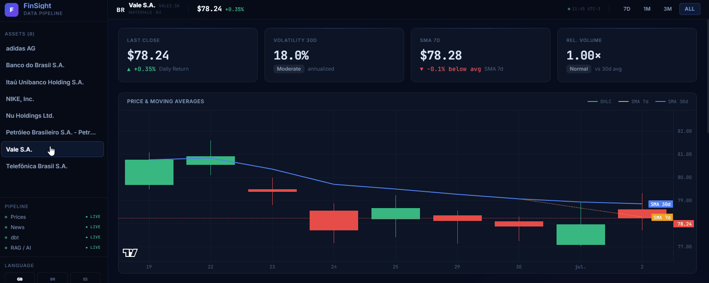
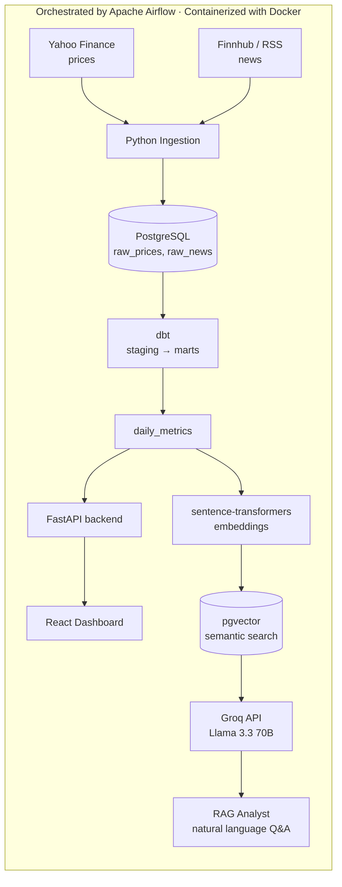

# FinSight — AI-Ready Market Data Pipeline with a RAG Analyst

> From raw market ticks to an AI analyst that answers grounded questions about your data.



[](https://python.org)
[](https://postgresql.org)
[](https://getdbt.com)
[](https://airflow.apache.org)
[](https://docker.com)
[](https://react.dev)
[](https://vitejs.dev)
[](https://fastapi.tiangolo.com)
[](https://console.groq.com)

---

## What it does

An **end-to-end daily data pipeline** that:

1. **Ingests** stock prices (Yahoo Finance) and market news (Finnhub / RSS) into PostgreSQL
2. **Transforms** raw data into clean analytical metrics using **dbt** (returns, moving averages, volatility)
3. **Orchestrates** the full pipeline with **Apache Airflow** — runs every weekday at 7:30 PM BRT
4. **Serves** an interactive dashboard via **React + FastAPI** for visual exploration
5. **Answers natural-language questions** via a **RAG pipeline** (embeddings + pgvector + **Groq Llama 3.3**) grounded in the pipeline's own data

---

## Architecture



---

## Stack

| Layer | Tool | Why |
|-------|------|-----|
| Language | Python 3.11 | Industry standard for data engineering |
| Database | PostgreSQL 16 + **pgvector** | Relational + vector search in one place |
| Transformation | **dbt** 1.8 | SQL-based modeling with tests and docs |
| Orchestration | **Apache Airflow** 2.9 | Visual DAGs, retries, monitoring |
| Containers | **Docker** + Compose | Zero "works on my machine" issues |
| Embeddings | sentence-transformers (local) | Free, no API calls for embedding |
| Generation | **Groq API** — Llama 3.3 70B | Free tier, fast inference, no billing required |
| Frontend | **React 18** + **Vite 5** | Modern SPA with hot reload |
| Backend | **FastAPI** | Async REST API + RAG endpoint |

---

## Run it in 5 minutes

### Prerequisites
- [Docker Desktop](https://www.docker.com/products/docker-desktop/) installed and running
- That's it.

### Steps

```bash
# 1. Clone the repository
git clone https://github.com/<your-user>/finsight-pipeline.git
cd finsight-pipeline

# 2. Set up environment variables
cp .env.example .env
# Edit .env and fill in your API keys

# 3. Start all services (Postgres + Airflow)
docker compose up -d

# Wait ~30 seconds for services to initialize, then:

# 4. Open Airflow at http://localhost:8080
#    Login: airflow / airflow
#    Trigger the "financial_pipeline" DAG manually

# 5. Start the backend API
uvicorn app.api.main:app --port 8000 --reload

# 6. Start the React dashboard
cd app/frontend && npm install && npm run dev
# Open http://localhost:5173
```

### Default tickers monitored
`PETR4.SA` (Petrobras) · `VALE3.SA` (Vale) · `ITUB4.SA` (Itaú Unibanco)

Change them via `STOCK_TICKERS` in your `.env` file.

---

## Project structure

```
finsight-pipeline/
├── docker-compose.yml          # Postgres (pgvector) + full Airflow stack
├── .env.example                # All required environment variables
├── requirements.txt            # Python dependencies (organized by layer)
│
├── finsight/                   # Core package
│   ├── db.py                   # DB connection: SQLAlchemy engine + healthcheck
│   └── __init__.py
│
├── ingestion/                  # Phase 1: raw data collection
│   ├── fetch_prices.py         # Yahoo Finance → raw_prices
│   └── fetch_news.py           # Finnhub / RSS → raw_news
│
├── dbt/                        # Phase 2: data transformation
│   ├── dbt_project.yml
│   ├── profiles.yml            # (gitignored — copy from profiles.yml.example)
│   └── models/
│       ├── staging/            # stg_prices, stg_news (views)
│       └── marts/              # daily_metrics (table)
│
├── dags/                       # Phase 3: Airflow orchestration
│   └── financial_pipeline_dag.py
│
├── ai/                         # Phase 5: RAG pipeline
│   ├── embed.py                # Chunk → embed → store in pgvector
│   ├── vectorstore.py          # Cosine similarity search
│   └── rag.py                  # Retrieval + LLM call
│
├── app/                        # Phase 4 & 6: dashboard
│   ├── api/
│   │   └── main.py             # FastAPI backend (REST + RAG endpoint)
│   └── frontend/               # React 18 + Vite 5 dashboard
│       └── src/
│           ├── components/     # KpiGrid, PriceChart, MetricsCharts, NewsFeed, RagSection, Sidebar, TopBar
│           ├── App.tsx         # Root component + AI overlay
│           ├── api.ts          # Fetch helpers (tickers, metrics, news, meta)
│           ├── types.ts        # Shared TypeScript interfaces
│           ├── i18n.ts         # EN / PT / ES translations
│           └── index.css       # Global styles + design tokens
│
├── infra/
│   └── init-db/                # SQL scripts auto-run on first Postgres start
│
├── docs/
│   └── demo.gif                # Dashboard demo (Phase 6)
│
└── scripts/
    └── verify_setup.py         # Smoke-test for DB connection and table presence
```

---

## Development phases

| Phase | Description | Status |
|---|---|---|
| 0 — Foundation | Docker, PostgreSQL + pgvector, project skeleton | ✅ Done |
| 1 — Ingestion | Prices (yfinance) + News (Finnhub/RSS) | ✅ Done |
| 2 — Transformation | dbt staging + daily_metrics mart | ✅ Done |
| 3 — Orchestration | Airflow DAG wiring everything together | ✅ Done |
| 4 — Dashboard | React + FastAPI dashboard with interactive charts | ✅ Done |
| 5 — RAG | Embeddings + pgvector + Groq Llama 3.3 Q&A | ✅ Done |
| 6 — Polish | Diagrams, GIFs, docs | ✅ Done |

---

## Key design decisions

**Why pgvector instead of a dedicated vector database (Pinecone, Weaviate, etc.)?**
→ Fewer moving parts. Relational data and vector data live in the same database, with consistent transactions. One connection string, one backup target.

**Why dbt instead of pandas for transformations?**
→ SQL is reviewable, testable, and versionable. The `schema.yml` tests catch data quality issues automatically on every run.

**Why the RAG is implemented from scratch (not LangChain)?**
→ The pipeline is ~50 lines: chunk → embed → similarity search → prompt → LLM. Understanding every line makes you able to explain and debug it in any interview.

**Why Airflow instead of a cron job?**
→ Visibility (graph view of each run), automatic retries, task dependencies, and a track record of production reliability. A cron job that fails silently is invisible; a failed Airflow task is in your face.

---

## What I learned

- Orchestrating multi-step pipelines with dependency management in Airflow
- Building a vector search layer on top of PostgreSQL using pgvector + HNSW indexes
- Designing idempotent data ingestion (upserts) that can be re-run safely
- Implementing RAG from first principles: chunking, embedding, cosine similarity, prompt injection
- Running a full data stack on a single machine with Docker Compose

---

## Local development tips

```bash
# Test price ingestion standalone (without Airflow)
python ingestion/fetch_prices.py --tickers PETR4.SA,VALE3.SA --days 7

# Test news ingestion
python ingestion/fetch_news.py --source rss --hours 48

# Run dbt models manually
cd dbt && dbt run --profiles-dir . --target dev

# Run dbt tests
cd dbt && dbt test --profiles-dir . --target dev

# Check database connection
python -m finsight.db
```

---

*Built as a portfolio project to demonstrate end-to-end data engineering skills — from raw market data to a production-ready AI analyst.*
